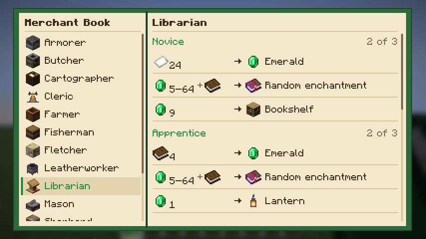

# Merchant Book

A Fabric mod for Minecraft 26.2 that adds a craftable **Merchant Book** (book + emerald).
Right-click it to see every trade each villager profession and the wandering trader can offer, level by level:
price ranges, biome-specific trades, possible enchantments and more.



## Requirements

- Minecraft 26.2
- Fabric Loader 0.19.5+
- Fabric API
- Installed on client and server (singleplayer: just the mods folder)

## Building

```
./gradlew build
```

The jar ends up in `build/libs`. `./gradlew runClientGameTest` starts an automated in-game test that takes screenshots.

## License

MIT
